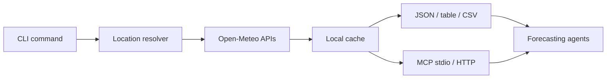

# Weather Signal

Weather Signal turns Open-Meteo forecasts into stable command-line outputs
for forecasting agents, scripts, and business workflows.

It is designed around a simple contract:

- JSON is the default output.
- Locations are resolved once and echoed in every response.
- Saved places make recurring business locations repeatable.
- Local caching keeps agent loops fast and predictable.
- MCP stdio and streamable HTTP transports expose the same workflows to agents.
- Demand signals summarize weather into features that are easy to join with
  demand, staffing, inventory, or campaign data.

## Core Commands

```bash
weather-signal signal london --country GB --days 7
weather-signal server start --transport stdio
weather-signal daily london --country GB --days 3 --table
weather-signal hourly "51.5072,-0.1276" --hours 24 --output csv
```

## Architecture



Start with the [Quickstart](getting-started/quickstart.md), then review the
[Signal Reference](reference/signals.md) for demand feature definitions.
